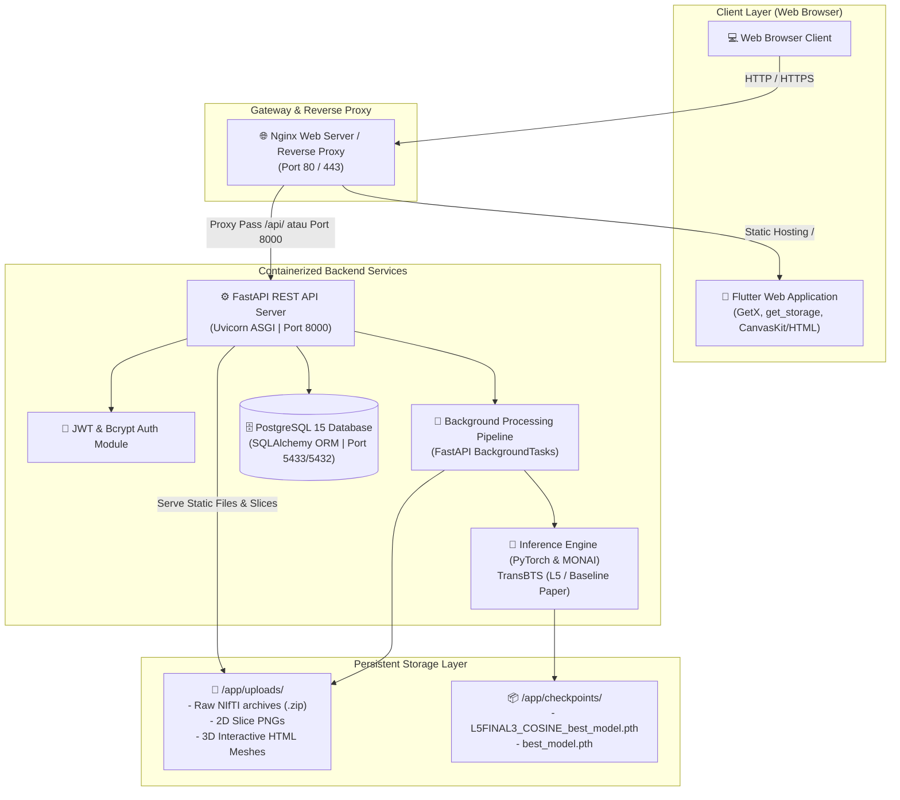

# 🧠 BrainScan AI — 3D Brain Tumor Detection & Segmentation System

[](https://github.com/RifandyZUl/BrainScanAI)
[](https://python.org)
[](https://fastapi.tiangolo.com)
[](https://pytorch.org)
[](https://monai.io)
[](https://flutter.dev)
[](https://postgresql.org)
[](https://docker.com)

**BrainScan AI** adalah platform sistem penunjang keputusan klinis (*Clinical Decision Support System / CDSS*) berbasis web yang dirancang untuk **deteksi dan segmentasi volumetrik 3D tumor otak** dari citra *Magnetic Resonance Imaging* (MRI). Sistem ini mengintegrasikan model *Deep Learning* berbasis arsitektur **TransBTS** (*Transformer-based Brain Tumor Segmentation*) dengan backend komputasi terisolasi dan antarmuka web klinis interaktif multi-peran (Admin, Radiolog, dan Dokter).

> ⚠️ **Pernyataan Medis & Akademis**: Sistem ini dikembangkan sebagai purwarupa penelitian akademis / tesis. Hasil analisis dan segmentasi AI ditujukan sebagai alat bantu visualisasi (*second opinion*) dan **tidak menggantikan diagnosis definitif klinisi medis profesional**.

---

## 📑 Daftar Isi

- [Arsitektur Sistem](#-arsitektur-sistem)
- [Spesifikasi Model AI & Pemrosesan Citra](#-spesifikasi-model-ai--pemrosesan-citra)
- [Fitur Utama](#-fitur-utama)
- [Hak Akses Berbasis Peran (RBAC)](#-hak-akses-berbasis-peran-rbac)
- [Technology Stack](#-technology-stack)
- [Struktur Repositori](#-struktur-repositori)
- [Panduan Instalasi & Menjalankan Sistem](#-panduan-instalasi--menjalankan-sistem)
  - [Opsi A: Menggunakan Docker Compose (Direkomendasikan)](#opsi-a-menggunakan-docker-compose-direkomendasikan)
  - [Opsi B: Menjalankan Secara Manual (Development Lokal)](#opsi-b-menjalankan-secara-manual-development-lokal)
- [Kredensial Pengujian (Seeding)](#-kredensial-pengujian-seeding)
- [Ringkasan REST API](#-ringkasan-rest-api)
- [Pengujian & Verifikasi](#-pengujian--verifikasi)
- [Keamanan Sistem](#-keamanan-sistem)
- [Lisensi & Kontributor](#-lisensi--kontributor)

---

## 📐 Arsitektur Sistem

Sistem mengadopsi pola arsitektur terdistribusi *Client-Server* berbasis REST API dengan pemisahan peran yang tegas antara lapisan presentasi (Frontend), logika bisnis & inferensi (Backend), serta persistensi data (PostgreSQL).



### Alur Data (*End-to-End Data Flow*):
1. **Autentikasi**: Pengguna mengirim kredensial ke `/token/` untuk mendapatkan JWT *Bearer token* dengan enkripsi HS256.
2. **Registrasi Pasien & Unggah Scan**: Radiolog mendaftarkan data rekam medis pasien, lalu mengunggah berkas MRI terkompresi (ZIP).
3. **Validasi & Ekstraksi Berkas**: Backend memvalidasi integritas berkas, melakukan sanitasi nama berkas (mitigasi *Zip-Slip*), dan mendeteksi 4 modalitas NIfTI standar.
4. **Eksekusi Inferensi Asinkron**: Pipeline inferensi dijalankan di latar belakang (*background worker*) menggunakan model TransBTS. Status kemajuan (*progress*) dapat dipantau berkala oleh klien via polling endpoint `/scan/{id}/status`.
5. **Generasi Irisan 2D & Rekonstruksi 3D**:
   - Menghitung irisan representatif (*dynamic slice detection*) pada bidang Aksial, Koronal, dan Sagital.
   - Menghasilkan representasi mesh 3D permukaan tumor (*marching cubes*) untuk visualisasi interaktif.
6. **Validasi Klinis**: Dokter memeriksa visualisasi irisan multi-planar dan rekonstruksi 3D, lalu menambahkan catatan diagnosis serta validasi klinis.

---

## 🔬 Spesifikasi Model AI & Pemrosesan Citra

### 1. Masukan Citra (Input Modalities)
Sistem menerima berkas citra medis format **NIfTI** (`.nii` atau `.nii.gz`) yang dikemas dalam arsip `.zip`. Sesuai standar konvensi **BraTS** (*Brain Tumor Segmentation Benchmark*), data masukan mencakup 4 sekuens MRI:

| Suffix | Modalitas | Keterangan Klinis |
|--------|-----------|-------------------|
| `_0000` | **T1-native (T1n)** | Evaluasi anatomi dasar dan batas parenkim otak |
| `_0001` | **T1-contrast / T1Gd (T1c)** | Menunjukkan diskontinuitas sawar darah otak (*enhancing tumor core*) |
| `_0002` | **T2-weighted (T2w)** | Deteksi akumulasi cairan dan hiperintensitas jaringan |
| `_0003` | **T2-FLAIR (T2f)** | Supresi cairan bebas untuk memperjelas batas edema peritumoral |

### 2. Varian Model TransBTS yang Didukung

Pipeline inferensi diimplementasikan dalam `backend-tumor/models_ckd/inference.py` dengan dua varian checkpoint:

1. **CKD-TransBTS Optimisasi L5** (`L5FINAL3_COSINE_best_model.pth` — ~4.2 MB):
   - **Arsitektur**: Kombinasi 3D CNN Encoder-Decoder dengan *Transformer Bottleneck* teroptimasi melalui *Cross-Knowledge Distillation* (CKD) dan jadwal *Cosine Annealing*.
   - **Ukuran ROI**: `(64, 64, 64)`, *sliding window overlap*: `0.6`.
   - **Karakteristik**: Komputasi sangat efisien, dirancang untuk eksekusi berbasis CPU pada server standar dengan penggunaan memori yang terkontrol.
   - **Output Kelas Multi-Label**:
     - `Label 0`: Background (Area di luar otak)
     - `Label 1`: **NETC** (*Non-Enhancing Tumor Core*)
     - `Label 2`: **SNFH** (*Surrounding Non-Enhancing FLAIR Hyperintensity / Edema*)
     - `Label 3`: **ET** (*Enhancing Tumor*)
     - `Label 4`: **RC** (*Resection Cavity*)
2. **CKD-TransBTS Baseline Paper** (`best_model.pth` — ~365 MB):
   - **Arsitektur**: Model baseline berkapasitas penuh sesuai rancangan paper referensi.
   - **Ukuran ROI**: `(128, 128, 128)`, *sliding window overlap*: `0.6`.
   - **Karakteristik**: Resolusi spasial tinggi dengan segmentasi sub-kompartemen *Whole Tumor* (WT), *Tumor Core* (TC), dan *Enhancing Tumor* (ET).

### 3. Algoritma Dynamic Slice Selection
Alih-alih menggunakan indeks irisan statis (*hardcoded*), sistem menerapkan algoritma dinamis:
- Pada kasus dengan tumor terdeteksi, sistem menghitung luas area piksel tumor pada seluruh irisan dan secara otomatis memilih irisan dengan **luas tumor maksimum**.
- Pada kasus tanpa tumor / jaringan normal, sistem memilih irisan dengan **volume penampang jaringan otak terluas**.

---

## ✨ Fitur Utama

- 🩻 **2D Multi-Planar Dynamic Slice Viewer**: Penampil irisan interaktif untuk bidang Aksial, Koronal, dan Sagital dengan kontrol *slider* kontinu, *pan & zoom*, penyesuaian kontras (*inverted colormap*), serta filter visualisasi per sub-kelas tumor.
- 🧊 **3D Interactive Mesh Surface Visualizer**: Rekonstruksi 3D berbasis WebGL (Plotly) yang dapat diputar 360 derajat, di-zoom, dan ditransformasikan langsung dari peramban web.
- ⏱️ **Real-Time Analysis Progress Polling**: Indikator pemrosesan bertahap (*uploading* → *preprocessing* → *AI inference* → *mesh generation* → *completed*).
- 📝 **Clinical Validation & Notes Module**: Fasilitas bagi dokter spesialis untuk menuliskan dan menyimpan catatan medis diagnosis resmi langsung ke dalam sistem.
- 📊 **Executive Dashboard**: Ringkasan statistik jumlah pemindaian, distribusi diagnosis, antrean analisis, dan status pasien.
- 🛡️ **Audit Trail & Logging**: Pencatatan riwayat setiap aksi pengguna (login, logout, registrasi pasien, analisis citra, modifikasi data) untuk kepatuhan regulasi data medis.

---

## 👥 Hak Akses Berbasis Peran (RBAC)

Sistem menerapkan prinsip *Least Privilege* dengan pembagian hak akses sebagai berikut:

| Modul / Fungsi | Administrator | Radiolog (`Sp.Rad`) | Dokter (`Sp.S`) |
|----------------|:-------------:|:-------------------:|:---------------:|
| Manajemen Akun Pengguna (CRUD) | ✅ | ❌ | ❌ |
| Monitoring Audit Trail Activity Log | ✅ | ❌ | ❌ |
| Registrasi & Modifikasi Pasien Baru | ✅ | ✅ | ❌ |
| Unggah File Scan MRI 3D (ZIP) | ❌ | ✅ | ❌ |
| Pemicu Eksekusi Inferensi AI | ❌ | ✅ | ❌ |
| Review Hasil Analisis 2D & 3D | ✅ *(View Only)* | ✅ | ✅ |
| Input Catatan Klinis & Diagnosis Dokter | ❌ | ❌ | ✅ |
| Pengaturan Profil Mandiri | ✅ | ✅ | ✅ |

---

## 🛠️ Technology Stack

| Komponen | Teknologi | Keterangan |
|----------|-----------|------------|
| **Frontend Framework** | [Flutter Web](https://flutter.dev/) (Dart SDK 3.x) | Single Page Application (SPA) responsif |
| **State Management** | [GetX](https://pub.dev/packages/get) & `get_storage` | Arsitektur reaktif & penyimpanan token lokal |
| **Backend Framework** | [FastAPI](https://fastapi.tiangolo.com/) (Python 3.10) | ASGI REST API performa tinggi |
| **Deep Learning Engine** | [PyTorch 2.5.1](https://pytorch.org/) & [MONAI 1.3.0](https://monai.io/) | Pemrosesan tensor citra medis 3D |
| **Medical Image Processing** | `nibabel`, `scipy`, `scikit-image`, `numpy` | Parsing NIfTI, marching cubes, & transformasi citra |
| **Database** | [PostgreSQL 15](https://www.postgresql.org/) | Penyimpanan relasional data rekam medis & pengguna |
| **ORM & Driver** | [SQLAlchemy](https://www.sqlalchemy.org/) & `psycopg2-binary` | Pemetaan objek relasional & koneksi pool |
| **Containerization** | [Docker](https://www.docker.com/) & Docker Compose v2 | Isolasi lingkungan backend dan database |
| **Keamanan & Autentikasi** | `python-jose` (JWT) & `passlib[bcrypt]` | Tokenisasi autentikasi & hashing kredensial |

---

## 📁 Struktur Repositori

```
BrainScanAI/
├── README.md                      # Dokumentasi komprehensif repositori
├── demo_api.py                    # Skrip Python demonstrasi pengujian REST API
├── project_final_documentation.md # Dokumentasi teknis deployment VPS & Nginx
│
├── backend-tumor/                 # Service Backend (FastAPI + PyTorch)
│   ├── main.py                    # Titik masuk FastAPI & router endpoint
│   ├── models.py                  # Skema database SQLAlchemy (User, Patient, MRIScan, Log)
│   ├── schemas.py                 # Schema validasi Pydantic request/response
│   ├── auth.py                    # Enkripsi password & JWT handler
│   ├── database.py                # Konfigurasi session & engine database
│   ├── seed.py                    # Inisialisasi akun staff & data dummy pasien
│   ├── Dockerfile                 # Konfigurasi container image backend
│   ├── docker-compose.yml         # Konfigurasi multi-container (Backend + DB)
│   ├── requirements.txt           # Daftar pustaka dependensi Python
│   ├── .env.example               # Template variabel lingkungan
│   ├── checkpoints/               # Direktori bobot model Deep Learning
│   │   ├── L5FINAL3_COSINE_best_model.pth  # Model L5 Optimisasi (~4.2 MB)
│   │   └── best_model.pth                  # Model Baseline Paper (~365 MB)
│   └── models_ckd/                # Modul arsitektur TransBTS & pipeline inferensi
│       ├── ckd_transbts_l5.py     # Arsitektur jaringan model L5
│       ├── ckd_transbts_paper.py  # Arsitektur jaringan model Paper
│       ├── paper_transforms.py    # Transformasi & preprocessing citra
│       └── inference.py           # Pipeline eksekusi sliding window & evaluasi
│
└── brain-tumor-detection-app/     # Service Frontend (Flutter Web)
    └── tumor-frontend/
        ├── pubspec.yaml           # Daftar dependensi Flutter/Dart
        ├── web/                   # Entry point peramban & index.html
        ├── assets/                # Aset gambar visual & ikon
        └── lib/                   # Source code utama Flutter
            ├── main.dart          # Inisialisasi tema, locale, & routing
            ├── controllers/       # Controller GetX (Admin, Dokter, Radiolog, Login)
            ├── models/            # Model representasi data Flutter
            ├── pages/             # Tampilan halaman per peran pengguna
            │   ├── login/         # Halaman autentikasi sistem
            │   ├── admin/         # Dashboard, manajemen user, log audit
            │   ├── radiolog/      # Dashboard radiolog, upload scan, daftar pasien
            │   ├── dokter/        # Dashboard dokter, catatan medis, review
            │   └── detail_analisis_page.dart # Penampil irisan 2D & visualizer 3D
            ├── routes/            # Definisi rute navigasi GetX
            └── utils/             # Konfigurasi API, warna tema, & utilitas
```

---

## 🚀 Panduan Instalasi & Menjalankan Sistem

### Prasyarat Lingkungan
- **Git** terpasang pada sistem.
- **Docker Desktop** (versi 20.x ke atas) dengan fitur Compose aktif.
- *(Opsional untuk development manual)*: **Python 3.10+**, **PostgreSQL 15**, dan **Flutter SDK 3.x**.

---

### Opsi A: Menggunakan Docker Compose (Direkomendasikan)

Cara ini menjalankan database PostgreSQL dan service FastAPI secara otomatis di dalam kontainer terisolasi.

#### 1. Clone Repositori
```bash
git clone https://github.com/RifandyZUl/BrainScanAI.git
cd BrainScanAI/backend-tumor
```

#### 2. Buat File Lingkungan (`.env`)
Salin template konfigurasi:
```bash
cp .env.example .env
```
Isi konfigurasi standar untuk Docker:
```env
DATABASE_URL=postgresql://postgres:passwordnabilaesd@db:5432/tumordb
SECRET_KEY=kunci_rahasia_brainscan_ai_2026
CORS_ORIGINS=*
```

#### 3. Jalankan Kontainer Docker
```bash
docker compose up -d --build
```
> *Catatan*: Proses build perdana membutuhkan waktu sekitar 5–15 menit untuk mengunduh layer dasar dan paket PyTorch CPU.

#### 4. Lakukan Seeding Database Awal
Setelah kontainer aktif, jalankan skrip pembuatan tabel dan akun bawaan:
```bash
docker exec -it brainscan-backend python seed.py
```

#### 5. Periksa Status Kontainer & Akses API
- **Swagger API Docs**: Buka peramban di [http://localhost:8000/docs](http://localhost:8000/docs)
- **ReDoc UI**: Buka di [http://localhost:8000/redoc](http://localhost:8000/redoc)

---

### Opsi B: Menjalankan Secara Manual (Development Lokal)

#### 1. Menjalankan Backend (FastAPI)
```bash
cd BrainScanAI/backend-tumor

# Buat virtual environment
python -m venv venv

# Aktivasi environment (Windows PowerShell)
.\venv\Scripts\Activate.ps1
# Aktivasi environment (Linux/macOS)
source venv/bin/activate

# Instalasi dependensi
pip install --upgrade pip setuptools wheel
pip install torch==2.5.1+cpu torchvision==0.20.1+cpu --extra-index-url https://download.pytorch.org/whl/cpu
pip install -r requirements.txt

# Jalankan server pengembangan
uvicorn main:app --host 0.0.0.0 --port 8000 --reload
```

#### 2. Menjalankan Frontend (Flutter Web)
Buka terminal baru:
```bash
cd BrainScanAI/brain-tumor-detection-app/tumor-frontend

# Unduh packages
flutter pub get

# Jalankan aplikasi di Google Chrome
flutter run -d chrome
```

---

## 🔑 Kredensial Pengujian (Seeding)

Setelah menjalankan `seed.py`, Anda dapat masuk menggunakan akun default berikut:

| Role | Username | Password | Deskripsi Tugas Utama |
|------|----------|----------|------------------------|
| **Administrator** | `admin` | `admin123` | Konfigurasi user staff, monitoring sistem & log aktivitas |
| **Dokter Spesialis** | `dokter` | `password123` | Tinjauan visualisasi 2D/3D & penulisan catatan medis |
| **Radiolog** | `radiolog` | `password123` | Registrasi pasien, unggah MRI NIfTI/ZIP, picu analisis AI |

---

## 🔌 Ringkasan REST API

| Method | Endpoint | Deskripsi Fungsi | Autentikasi |
|--------|----------|------------------|:-----------:|
| `POST` | `/token/` | Autentikasi login & penerbitan token JWT | Public |
| `POST` | `/logout/` | Invalidasi sesi & pencatatan log keluar | Bearer Token |
| `GET` | `/users/me/` | Mengambil profil user yang sedang aktif | Bearer Token |
| `GET` | `/users/` | Mengambil daftar seluruh staf medis | Admin |
| `POST` | `/users/` | Pendaftaran akun staf medis baru | Admin |
| `GET` | `/patients/` | Mengambil daftar data rekam medis pasien | All Roles |
| `POST` | `/patients/` | Registrasi identitas pasien baru | Admin, Radiolog |
| `POST` | `/upload-mri/` | Unggah arsip ZIP MRI & jalankan segmentasi AI | Radiolog |
| `GET` | `/scan/{scan_id}/status` | Polling persentase progres pemrosesan AI | All Roles |
| `GET` | `/analisis/{id}` | Detail lengkap hasil analisis, confidence, & metrik | All Roles |
| `GET` | `/analisis/{id}/slice` | Render dinamis irisan 2D (Sagittal/Coronal/Axial) | All Roles |
| `GET` | `/analisis/{id}/info` | Metadata volume shape & konfigurasi irisan | All Roles |
| `PUT` | `/analisis/{id}/update-notes/` | Penyimpanan catatan klinis diagnosis dokter | Dokter |
| `GET` | `/dashboard-summary/` | Metrik agregasi statistik dashboard utama | All Roles |
| `GET` | `/logs/` | Riwayat jejak audit aktivitas sistem | Admin |

---

## 🧪 Pengujian & Verifikasi

### 1. Uji Validitas Kode Frontend
Untuk memastikan tidak terdapat *compile error* maupun *syntax regression* pada aplikasi Flutter:
```bash
cd brain-tumor-detection-app/tumor-frontend
dart analyze lib
```
*Hasil yang diharapkan: `No issues found!`*

### 2. Uji Integrasi Endpoint Backend via Skrip Demonstrasi
Tersedia skrip pengujian otomatis `demo_api.py` di root proyek untuk menguji siklus lengkap: autentikasi, pengambilan profil, pembacaan data pasien, dan ringkasan dashboard:
```bash
python demo_api.py
```

---

## 🔒 Keamanan Sistem

1. **Autentikasi & Autorisasi**:
   - Kata sandi disimpan menggunakan fungsi hash satu arah **Bcrypt** dengan salt acak.
   - Sesi komunikasi diamankan menggunakan **JSON Web Token (JWT)** berstandar RFC 7519.
2. **Mitigasi Kerentanan Pengunggahan Berkas**:
   - Perlindungan terhadap serangan **Zip-Slip (Path Traversal)** melalui verifikasi canonical path pada setiap entri arsip yang diekstrak.
3. **Integritas Basis Data**:
   - Seluruh kueri data menggunakan **SQLAlchemy ORM** dengan *parameterized queries* untuk mencegah injeksi SQL (*SQL Injection*).
4. **CORS Hardening**:
   - Header *Cross-Origin Resource Sharing* dikonfigurasi melalui variabel lingkungan untuk membatasi domain klien yang diizinkan pada mode produksi.

---

## 📄 Lisensi & Kontributor

- **Pengembang**: [RifandyZUl](https://github.com/RifandyZUl)
- **Repositori Resmi**: [BrainScanAI GitHub Repository](https://github.com/RifandyZUl/BrainScanAI)
- **Lisensi**: Proyek ini dikembangkan untuk kepentingan akademik dan penelitian (*Academic Research & Educational Use*).

Copyright © 2026 **BrainScan AI Team**. All Rights Reserved.
