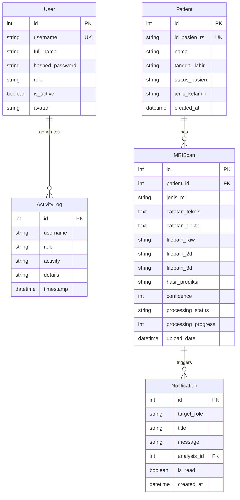

# 🧠 BrainScan AI — FastAPI Backend & Deep Learning Engine

[](https://fastapi.tiangolo.com)
[](https://pytorch.org)
[](https://monai.io)
[](https://postgresql.org)
[](https://docker.com)

Repositori ini berisi **sistem backend berbasis REST API dan engine AI** untuk aplikasi **BrainScan AI (3D Brain Tumor Detection & Segmentation)**. Backend dibangun menggunakan **FastAPI**, **PostgreSQL**, **SQLAlchemy ORM**, serta terintegrasi langsung dengan model *Deep Learning* 3D berbasis **PyTorch** dan **MONAI**.

Seluruh service backend telah dikontainerisasi menggunakan **Docker & Docker Compose** sehingga mudah di-deploy di lingkungan pengujian maupun produksi tanpa menginstal dependency Python dan PyTorch secara manual.

---

## 🛠️ Prasyarat Penginstalan (*Prerequisites*)

Sebelum memulai setup backend, pastikan perangkat Anda telah memenuhi prasyarat berikut:
1. **Git** - [Download Git](https://git-scm.com/downloads)
2. **Docker Desktop** (atau Docker Engine di Linux) - [Download Docker](https://www.docker.com/products/docker-desktop/)

> **Penting**: Pastikan Docker daemon/Desktop dalam keadaan aktif (*running*) sebelum menjalankan perintah Docker Compose.

---

## 📐 Arsitektur & Model AI (*AI Models Architecture*)

Backend BrainScan AI mendukung dua varian model Deep Learning untuk segmentasi tumor otak 3D:

1. **TransBTS Paper Model (`best_model.pth` | ~348 MB)**:
   - Arsitektur gabungan 3D CNN Encoder dan Transformer Self-Attention.
   - Presisi segmentasi sangat tinggi untuk sub-region tumor (NETC, SNFH, ET, RC).
2. **L5 Optimized Model (`L5FINAL3_COSINE_best_model.pth` | ~4 MB)**:
   - Arsitektur teroptimisasi dengan ukuran biner sangat kecil dan efisiensi memori tinggi.
   - Ideal untuk eksekusi berbasis CPU pada server VPS standar tanpa GPU dedicated.

### Algoritma Dynamic Slice Selection
Backend tidak lagi menggunakan indeks irisan *hardcoded* (misal slice 75). Sistem mengimplementasikan **Dynamic Slice Selection**:
- **Kasus Tumor Terdeteksi**: Otomatis mendeteksi irisan aksial/sagital/koronal yang memiliki **luas piksel tumor terbesar**.
- **Kasus Otak Normal**: Otomatis memilih irisan dengan **volume jaringan otak terbesar**.

---

## 🗄️ Skema Database & Relasi (*Database Schema*)

Sistem menggunakan database PostgreSQL dengan 5 entitas utama:



---

## 🔑 Konfigurasi Environment Variable (`.env`)

Backend membaca variabel lingkungan dari file `.env`. Gunakan `.env.example` sebagai referensi:

```env
# Database Credentials
POSTGRES_USER=postgres
POSTGRES_PASSWORD=passwordnabilaesd
POSTGRES_DB=tumordb
POSTGRES_HOST=db
POSTGRES_PORT=5432
DATABASE_URL=postgresql://postgres:passwordnabilaesd@db:5432/tumordb

# Security Configuration
SECRET_KEY=b8f5e9d2a3c7146081e9f02a4d5b6c7e8f9a0b1c2d3e4f5a6b7c8d9e0f1a2b3c
ALGORITHM=HS256
ACCESS_TOKEN_EXPIRE_MINUTES=480

# CORS Allowed Origins (Comma-separated or * for dev)
CORS_ORIGINS=*
```

---

## ⚙️ Panduan Setup & Inisialisasi Lokal

### 1. Clone Repositori & Masuk ke Folder Backend
```bash
git clone https://github.com/nabilaekasd/backend-tumor.git
cd backend-tumor
```

### 2. Buat File Environment (`.env`)
```bash
cp .env.example .env
```

### 3. Build & Jalankan Docker Container
```bash
docker compose up --build -d
```
*Port 8000 (FastAPI) dan Port 5433 (PostgreSQL external host) akan siap digunakan.*

### 4. Inisialisasi Data Default (Database Seeding)
Jalankan script `seed.py` di dalam container `axon-backend`:
```bash
docker exec -it axon-backend python seed.py
```

### 5. Verifikasi Status Container
```bash
docker ps
```
Pastikan `axon-backend` dan `axon-postgres` berstatus `Up (healthy)`.

---

## 🔑 Akun & Kredensial Default

Setelah seeding, gunakan akun bawaan berikut untuk login:

| Role | Username | Password | Otoritas |
|------|----------|----------|----------|
| **Admin** | `admin` | `admin123` | Full Access (User CRUD, System Logs) |
| **Dokter** | `dokter` | `password123` | Patient View, Clinical Notes Update |
| **Radiolog** | `radiolog` | `password123` | Patient Registration, MRI Upload |

---

## 📡 API Endpoints Reference

Dokumentasi interaktif Swagger UI tersedia di **[http://localhost:8000/docs](http://localhost:8000/docs)**.

### 1. Authentication & Profil
- `POST /token/` — Login user (Form Data: `username`, `password`) $\rightarrow$ Mengembalikan OAuth2 Access Token.
- `POST /logout/` — Logout & pencatatan activity log.
- `GET /users/me/` — Mengambil informasi profil pengguna terotentikasi.
- `POST /users/upload-avatar/` — Unggah foto profil pengguna.

### 2. User Management (Admin Only)
- `GET /users/` — Mengambil seluruh daftar pengguna.
- `POST /users/` — Membuat pengguna/staff baru.
- `PUT /users/{user_id}` — Mengubah profil/role/password pengguna.
- `DELETE /users/{user_id}` — Menghapus pengguna.

### 3. Patient Management
- `GET /patients/` — Mengambil daftar pasien.
- `POST /patients/` — Mendaftarkan pasien baru (ID Rekam Medis otomatis `RM-XXXXXX`).
- `PUT /patients/{patient_id}` — Mengubah data pasien.

### 4. MRI Scan & AI Processing
- `POST /upload-mri/` — Unggah file ZIP MRI NIfTI. FastAPI menerima file, melakukan keamanan Zip-Slip check, dan memicu AI Worker.
- `GET /scan/{scan_id}/status` — Polling status pengerjaan AI (`processing_status`, `processing_progress`, `processing_message`).
- `GET /analisis/{analysis_id}/slice` — Menghasilkan gambar irisan 2D MRI (Query params: `plane=axial/sagittal/coronal`, `idx`, `contrast_min`, `contrast_max`).
- `GET /analisis/{analysis_id}/info` — Mengambil metrik segmentasi AI (Dice score, volume tumor, status prediksi).
- `PUT /analisis/{analysis_id}/update-notes/` — Meng-update catatan diagnosis medis oleh dokter.

### 5. Dashboard & Analytics
- `GET /dashboard-summary/` — Mendapatkan jumlah total pasien, antrean analisis, dan analisis selesai.
- `GET /logs/` — Mengambil data audit log aktivitas pengguna (Filterable: `role`, `start_date`, `end_date`).
- `GET /notifications/` — Mengambil notifikasi sistem sesuai target role.

---

## 🛡️ Keamanan & Hardening (*Security Features*)

1. **Proteksi Zip-Slip (Path Traversal)**:
   Proses ekstraksi archive ZIP memverifikasi setiap target path file. Jika terdeteksi karakter path traversal (`../../`), request langsung ditolak dengan status HTTP `400 Bad Request`.
2. **SQL Injection Immunity**:
   Seluruh query ke database menggunakan ORM SQLAlchemy dengan *parameterized binding*, mencegah manipulasi query SQL secara mutlak.
3. **Keamanan Password**:
   Password disimpan menggunakan *one-way salted password hashing* Bcrypt (peta karakter terenskripsi).
4. **JWT Expiration & Verification**:
   Setiap endpoint terlindungi memverifikasi token HS256 JWT header `Authorization: Bearer <token>`.

---

## 🛑 Menghentikan & Restart Service

Menghentikan container backend:
```bash
docker compose down
```

Menghentikan container dan menghapus volume database (Reset total):
```bash
docker compose down -v
```

---

## 📄 Lisensi
Copyright © 2026 **BrainScan AI Team**. All Rights Reserved.