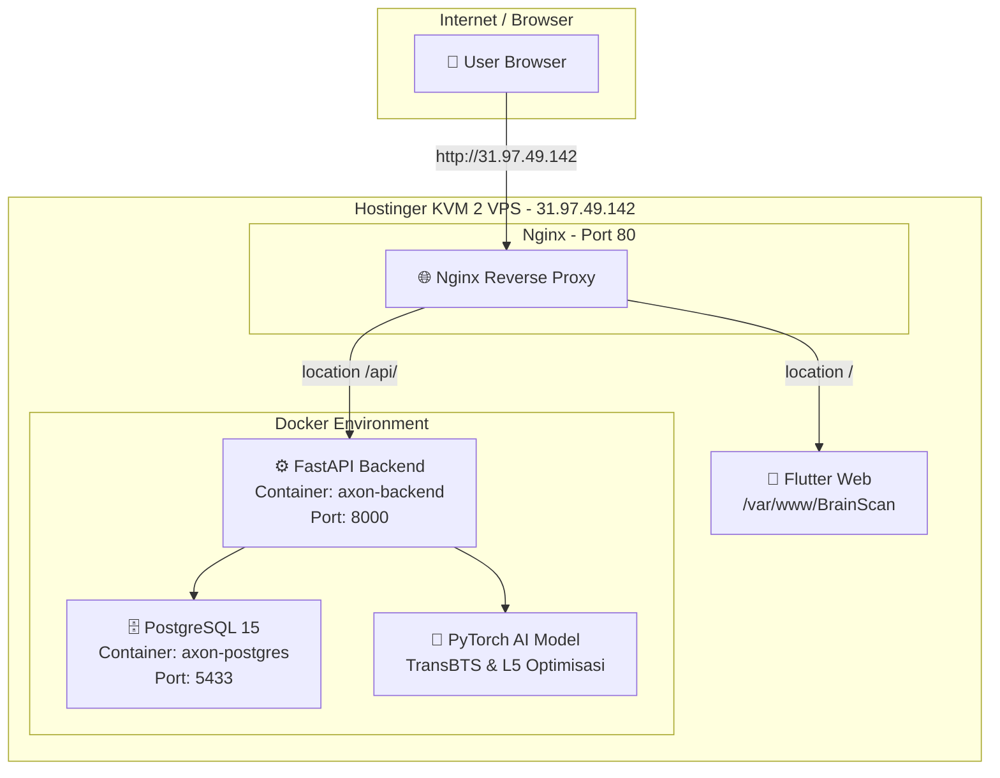

# 📋 Dokumentasi Teknis Lengkap — BrainScan AI
**Brain Tumor Detection & Segmentation System**

| Item | Detail |
|------|--------|
| **Prepared by** | Senior Software Architect |
| **Project Status** | ✅ Production — Live & Deployed |
| **Live URL** | http://31.97.49.142 |
| **Server** | Hostinger KVM 2 VPS (2 vCPUs, 8 GB RAM, 100 GB NVMe) |
| **OS** | Ubuntu 22.04 LTS |
| **Tanggal Deploy** | 5 Juli 2026 |

---

## Daftar Isi
1. [Arsitektur Sistem](#1-arsitektur-sistem)
2. [Technology Stack](#2-technology-stack)
3. [Fase 1: Redesign UI/UX & Brand Alignment](#3-fase-1-redesign-uiux--brand-alignment)
4. [Fase 2: Bug Fixes & Diagnostic Resolution](#4-fase-2-bug-fixes--diagnostic-resolution)
5. [Fase 3: Security Hardening](#5-fase-3-security-hardening)
6. [Fase 4: Deployment ke Hostinger VPS](#6-fase-4-deployment-ke-hostinger-vps)
7. [Konfigurasi Server](#7-konfigurasi-server)
8. [Panduan Maintenance](#8-panduan-maintenance)
9. [Troubleshooting](#9-troubleshooting)
10. [Informasi Akses & Kredensial](#10-informasi-akses--kredensial)

---

## 1. Arsitektur Sistem



### Alur Kerja Sistem
1. **User** mengakses `http://31.97.49.142` melalui browser
2. **Nginx** menerima request dan menentukan routing:
   - Request ke `/` → diarahkan ke file statis Flutter Web (`/var/www/BrainScan/`)
   - Request ke `/api/` → di-proxy ke FastAPI backend (port 8000)
3. **FastAPI** memproses request API (autentikasi, CRUD pasien, upload MRI)
4. **PostgreSQL** menyimpan data pasien, scan MRI, dan hasil analisis
5. **PyTorch AI** (TransBTS/L5) melakukan segmentasi tumor pada volume MRI 3D

---

## 2. Technology Stack

### Frontend
| Teknologi | Versi | Fungsi |
|-----------|-------|--------|
| Flutter | 3.x | Framework UI cross-platform |
| Dart | 3.x | Bahasa pemrograman |
| GetX | Latest | State management & routing |
| get_storage | Latest | Penyimpanan token JWT lokal |
| http | Latest | HTTP client untuk API calls |
| flutter_svg | Latest | Rendering ikon SVG custom |

### Backend
| Teknologi | Versi | Fungsi |
|-----------|-------|--------|
| Python | 3.10 | Bahasa pemrograman |
| FastAPI | Latest | Web framework (REST API) |
| Uvicorn | Latest | ASGI server |
| SQLAlchemy | Latest | ORM database |
| PostgreSQL | 15 | Database relasional |
| PyTorch | 2.5.1 (CPU) | Deep learning inference |
| MONAI | 1.3.0 | Medical imaging framework |
| Bcrypt | 3.2.2 | Hashing password |
| python-jose | Latest | JWT token generation |

### Infrastructure
| Teknologi | Fungsi |
|-----------|--------|
| Docker & Docker Compose | Containerization |
| Nginx | Reverse proxy & static file server |
| UFW | Firewall |
| Cron | Automated database backup |

---

## 3. Fase 1: Redesign UI/UX & Brand Alignment

### A. Halaman Login
- **Panel Kiri**: Background Pine Green (`#09503C`) dengan gambar holographic brain transparan dan footer informasi korporat
- **Panel Kanan**: Form login dengan border highlight brand. Typography logo: **"Neuro"** dalam warna charcoal, **"Scan"** dalam Emerald Green (`#037B55`)

### B. Kartu Riwayat Scan MRI (`HistoryScanItemTile`)
- **Timeline Vertikal**: Garis timeline kiri dengan warna `#92D0C6` opacity 40%, dilengkapi indikator dot double-ring
- **Ikon Otak Custom SVG**: Integrasi ikon otak multi-warna detail yang disediakan pengguna menggunakan `flutter_svg`
- **Badge Prediksi Dinamis**:
  - ✅ *Normal / Aman*: Background `#D1FAE5`, teks `#065F46`
  - 🔴 *Tumor Terdeteksi*: Background `#FEE2E2`, teks `#991B1B`
  - ⚪ *Gagal Diproses AI*: Background abu-abu terang, teks abu-abu gelap
- **Area Keluhan Kondisional**: Jika keluhan kosong/default, area teks disembunyikan sepenuhnya, hanya menampilkan gambar irisan MRI

### C. Responsivitas Mobile & Drawer Fix
- Perbaikan bug drawer menu pada viewport kecil (smartphone/tablet) yang sebelumnya menampilkan teks putih di atas background putih

---

## 4. Fase 2: Bug Fixes & Diagnostic Resolution

### A. Crash Halaman Detail Pasien
| Item | Detail |
|------|--------|
| **Gejala** | Error `Cannot hit test a render box with no size` (13x berulang) |
| **Akar Masalah** | Layout menggunakan constraint tak terbatas (nesting ListView/Column tanpa sizing) |
| **Solusi** | Restrukturisasi layout menggunakan `Flexible`, `IntrinsicHeight`, dan constrained ListView physics |

### B. Gambar Irisan Otak Terpotong
| Item | Detail |
|------|--------|
| **Gejala** | Gambar MRI pada kartu riwayat terpotong setengah (bagian atas hitam) |
| **Akar Masalah** | Endpoint `/analisis/{id}/slice` menggunakan indeks hardcoded `idx = 75` yang jatuh di area leher/dasar tengkorak |
| **Solusi** | Implementasi **Dynamic Slice Selection**: |
| | • Scan dengan tumor → otomatis memilih slice dengan **area tumor terluas** |
| | • Scan normal → memilih slice dengan **volume jaringan otak terbesar** |
| | • Indeks di-clamp antara `0` dan `axis_size - 1` untuk mencegah IndexError |

### C. Metrik Evaluasi Dataset Tanpa Segmentasi
| Item | Detail |
|------|--------|
| **Gejala** | Dataset tanpa file `_seg.nii.gz` tidak menampilkan metrik evaluasi |
| **Akar Masalah** | Metrik evaluasi (Dice Score, Hausdorff, dll.) memerlukan ground truth segmentasi sebagai pembanding |
| **Solusi** | Ini adalah perilaku yang benar dan by design — metrik evaluasi hanya bisa dihitung jika ada ground truth |

---

## 5. Fase 3: Security Hardening

### A. Environment-Driven Configuration
| Variabel | File | Fungsi |
|----------|------|--------|
| `DATABASE_URL` | `.env` → `database.py` | Connection string PostgreSQL |
| `SECRET_KEY` | `.env` → `auth.py` | Signing key untuk JWT token |
| `CORS_ORIGINS` | `.env` → `main.py` | Daftar domain yang diizinkan mengakses API |

- File `.env.example` dibuat sebagai template konfigurasi
- Tidak ada kredensial yang tersimpan langsung di kode sumber (source code)

### B. Proteksi Zip-Slip (Path Traversal)
| Item | Detail |
|------|--------|
| **Kerentanan** | `zip_ref.extractall()` Python mengekstrak file sesuai nama dalam zip, memungkinkan path traversal (`../../malicious.py`) |
| **Perbaikan** | Validasi individual setiap zip member — resolved path harus tetap di dalam `input_dir`. Jika terdeteksi traversal → `400 Bad Request` |

### C. CORS Hardening
- Middleware CORS FastAPI membaca allowed origins dari environment variable `CORS_ORIGINS`
- Mendukung multiple domain (comma-separated)
- Default fallback ke `*` untuk backward compatibility saat development

### D. Keamanan Bawaan Sistem
| Aspek | Implementasi |
|-------|-------------|
| **SQL Injection** | Kebal — SQLAlchemy ORM menggunakan parameterized queries |
| **Password Storage** | Bcrypt hashing (one-way, salted) |
| **Authentication** | JWT Token (HS256) dengan expiration |
| **Firewall** | UFW — hanya port 22 (SSH), 80 (HTTP), 443 (HTTPS) yang terbuka |

---

## 6. Fase 4: Deployment ke Hostinger VPS

### Kronologi Deployment

#### Langkah 1: Pembelian & Setup VPS
1. Membeli paket **Hostinger KVM 2** (2 vCPU, 8 GB RAM, 100 GB NVMe)
2. Memilih OS: **Ubuntu 22.04 LTS** (Plain OS)
3. Mengaktifkan add-on: **Malware Scanner** (gratis) + **Docker Manager**
4. Membuat root password

#### Langkah 2: Konfigurasi Server
Masuk ke server via SSH:
```bash
ssh root@31.97.49.142
```

Update sistem:
```bash
apt update && apt upgrade -y
```

Docker sudah terinstal otomatis (Docker Manager add-on). Verifikasi:
```bash
docker compose version
# Output: Docker Compose version v5.3.0
```

#### Langkah 3: Aktivasi SWAP Memory (RAM Cadangan AI)
```bash
fallocate -l 4G /swapfile && chmod 600 /swapfile && mkswap /swapfile && swapon /swapfile
echo '/swapfile none swap sw 0 0' >> /etc/fstab
```

#### Langkah 4: Instalasi Nginx
```bash
apt install nginx -y
```

#### Langkah 5: Upload Kode Backend
Dari terminal Windows lokal:
```bash
scp -r "C:\Sempro\SistemUjiCoba\backend-tumor" root@31.97.49.142:/root/
```

#### Langkah 6: Konfigurasi Environment Production
```bash
nano /root/backend-tumor/.env
```
Mengganti `SECRET_KEY` dengan key acak yang di-generate via:
```bash
openssl rand -hex 32
```

#### Langkah 7: Build & Start Docker Containers
```bash
cd /root/backend-tumor && docker compose up -d --build
```
Build time: ~3 menit. Mengunduh dan menginstal PyTorch CPU, MONAI, dan seluruh dependency.

#### Langkah 8: Konfigurasi Firewall
```bash
ufw allow 22 && ufw allow 80 && ufw allow 443 && ufw enable
```

#### Langkah 9: Konfigurasi Nginx Reverse Proxy
```nginx
server {
    listen 80;
    server_name 31.97.49.142;

    # Backend API
    location /api/ {
        proxy_pass http://localhost:8000/;
        proxy_set_header Host $host;
        proxy_set_header X-Real-IP $remote_addr;
        proxy_set_header X-Forwarded-For $proxy_add_x_forwarded_for;
        proxy_set_header X-Forwarded-Proto $scheme;
        client_max_body_size 500M;
    }

    # Frontend (Flutter Web)
    location / {
        root /var/www/BrainScan;
        try_files $uri $uri/ /index.html;
    }
}
```

#### Langkah 10: Update API URL Frontend
File `lib/utils/api_config.dart`:
```dart
class ApiConfig {
  // VPS Hostinger KVM 2
  static const String _vpsUrl = "http://31.97.49.142/api";

  // URL untuk di laptop (Development)
  static const String _localUrl = "http://127.0.0.1:8000";

  static String get baseUrl {
    if (kReleaseMode) {
      return _vpsUrl;
    } else {
      return _localUrl;
    }
  }
}
```

#### Langkah 11: Build & Upload Flutter Web
```bash
# Di komputer lokal
flutter build web

# Upload ke VPS
scp -r "...\build\web" root@31.97.49.142:/var/www/BrainScan
```

#### Langkah 12: Seed Database & Verifikasi
```bash
docker exec -it axon-backend python seed.py
```

✅ **Deployment selesai — sistem live dan dapat diakses publik!**

---

## 7. Konfigurasi Server

### Struktur File di VPS
```
/root/
├── backend-tumor/              # Kode backend FastAPI
│   ├── .env                    # Environment variables (production)
│   ├── docker-compose.yml      # Docker orchestration
│   ├── Dockerfile              # Container build config
│   ├── main.py                 # FastAPI application
│   ├── models.py               # SQLAlchemy database models
│   ├── database.py             # Database connection
│   ├── auth.py                 # JWT authentication
│   ├── best_model.pth          # Model AI Paper (348 MB)
│   ├── L5FINAL3_COSINE_best_model.pth  # Model AI Optimisasi (4 MB)
│   └── model/                  # Inference & architecture code
└── backups/                    # Auto-generated database backups

/var/www/BrainScan/             # Flutter Web frontend (static files)
├── index.html
├── main.dart.js
├── assets/
├── canvaskit/
└── icons/

/etc/nginx/sites-available/
└── BrainScan                   # Nginx virtual host config
```

### Docker Containers
| Container | Image | Port | Fungsi |
|-----------|-------|------|--------|
| `axon-backend` | `backend-tumor-fastapi-backend` | 8000 | FastAPI + AI inference |
| `axon-postgres` | `postgres:15-alpine` | 5433 | Database PostgreSQL |

### Firewall Rules (UFW)
| Port | Protokol | Status | Fungsi |
|------|----------|--------|--------|
| 22 | TCP | ✅ ALLOW | SSH access |
| 80 | TCP | ✅ ALLOW | HTTP (Nginx) |
| 443 | TCP | ✅ ALLOW | HTTPS (reserved for future SSL) |
| 5432/5433 | TCP | ❌ DENY | PostgreSQL (tidak bisa diakses dari luar) |
| 8000 | TCP | ❌ DENY | FastAPI (hanya via Nginx proxy) |

---

## 8. Panduan Maintenance

### 8.1 Backup Database
Backup otomatis sudah dikonfigurasi via cron job:
- **Jadwal**: Setiap hari jam 02:00 WIB
- **Lokasi**: `/root/backups/backup_YYYY-MM-DD.sql`
- **Retensi**: 30 hari (backup lebih lama otomatis dihapus)

Backup manual:
```bash
docker exec axon-postgres pg_dump -U postgres tumordb > /root/backups/backup_manual_$(date +%F).sql
```

Restore dari backup:
```bash
cat /root/backups/backup_2026-07-05.sql | docker exec -i axon-postgres psql -U postgres tumordb
```

### 8.2 Update Kode Backend
```bash
# 1. Upload file baru dari Windows ke VPS via SCP
scp -r "C:\Sempro\SistemUjiCoba\backend-tumor" root@31.97.49.142:/root/

# 2. SSH ke VPS, rebuild container
ssh root@31.97.49.142
cd /root/backend-tumor && docker compose up -d --build
```

### 8.3 Update Frontend Flutter
```bash
# 1. Build di lokal
cd C:\Sempro\SistemUjiCoba\brain-tumor-detection-app\tumor-frontend
flutter build web

# 2. Upload ke VPS
scp -r "...\build\web" root@31.97.49.142:/var/www/BrainScan

# 3. Di VPS, pindahkan file dan restart Nginx
mv /var/www/BrainScan/web/* /var/www/BrainScan/ && rm -rf /var/www/BrainScan/web
systemctl restart nginx
```

### 8.4 Restart Server / Containers
```bash
# Restart semua container
cd /root/backend-tumor && docker compose restart

# Restart hanya backend
docker restart axon-backend

# Restart hanya database
docker restart axon-postgres

# Restart Nginx
systemctl restart nginx
```

### 8.5 Cek Penggunaan Resource
```bash
# Cek RAM & CPU
htop

# Cek disk space
df -h

# Cek Docker container status
docker ps

# Cek SWAP usage
free -h
```

---

## 9. Troubleshooting

### ❌ Website tidak bisa diakses
```bash
# Cek Nginx status
systemctl status nginx

# Cek apakah container berjalan
docker ps

# Jika container mati, restart
cd /root/backend-tumor && docker compose up -d
```

### ❌ Login gagal / "Kesalahan Koneksi"
```bash
# Cek log backend
docker logs axon-backend --tail 50

# Cek apakah backend merespons
curl http://localhost:8000/riwayat-semua/
```

### ❌ Upload MRI gagal / timeout
```bash
# Cek RAM (mungkin OOM saat inference)
free -h

# Cek log detail
docker logs axon-backend --tail 100
```

### ❌ Container mati sendiri (OOM Killed)
```bash
# Cek apakah SWAP aktif
swapon --show

# Jika tidak aktif, aktifkan kembali
swapon /swapfile
```

### ❌ SSH tidak bisa masuk
- Reset root password dari **Dashboard Hostinger VPS** → Settings → Reset Root Password
- Pastikan port 22 terbuka: cek dari dashboard Hostinger

---

## 10. Informasi Akses & Kredensial

### Server VPS
| Item | Detail |
|------|--------|
| **Provider** | Hostinger KVM 2 |
| **IP Address** | `31.97.49.142` |
| **OS** | Ubuntu 22.04 LTS |
| **SSH Access** | `ssh root@31.97.49.142` |
| **Root Password** | *(disimpan di dashboard Hostinger)* |

### Akses Website
| Item | URL |
|------|-----|
| **Frontend** | http://31.97.49.142 |
| **Backend API** | http://31.97.49.142/api/ |

### File Konfigurasi Penting
| File | Lokasi di VPS |
|------|---------------|
| Environment Variables | `/root/backend-tumor/.env` |
| Docker Compose | `/root/backend-tumor/docker-compose.yml` |
| Nginx Config | `/etc/nginx/sites-available/BrainScan` |
| Cron Backup | `crontab -e` (root user) |

---
## Cek Backup Berjalan
ls -la /root/backups/


> [!IMPORTANT]
> **Upgrade Path (Opsional di Masa Depan)**:
> 1. **Custom Domain + HTTPS**: Beli domain → arahkan DNS → pasang SSL gratis via Certbot
> 2. **GPU Acceleration**: Upgrade ke VPS dengan GPU NVIDIA untuk inference AI 10-100x lebih cepat
> 3. **Task Queue**: Tambahkan Celery + Redis jika perlu menangani upload MRI bersamaan dari banyak user

---

*Dokumentasi ini berlaku per tanggal 5 Juli 2026. Sistem BrainScan AI v1.0 — Production Release.*
